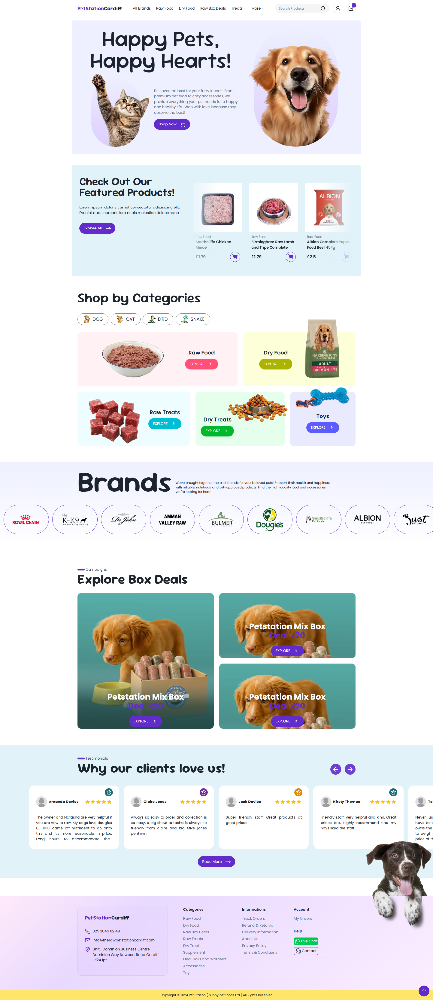
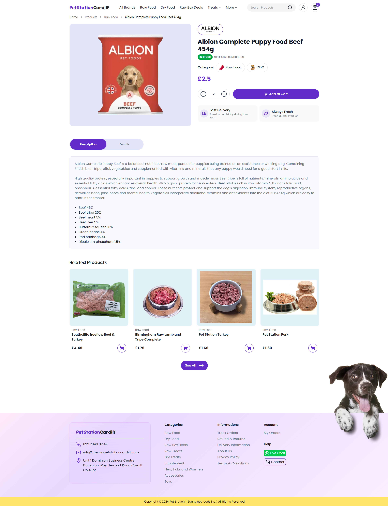
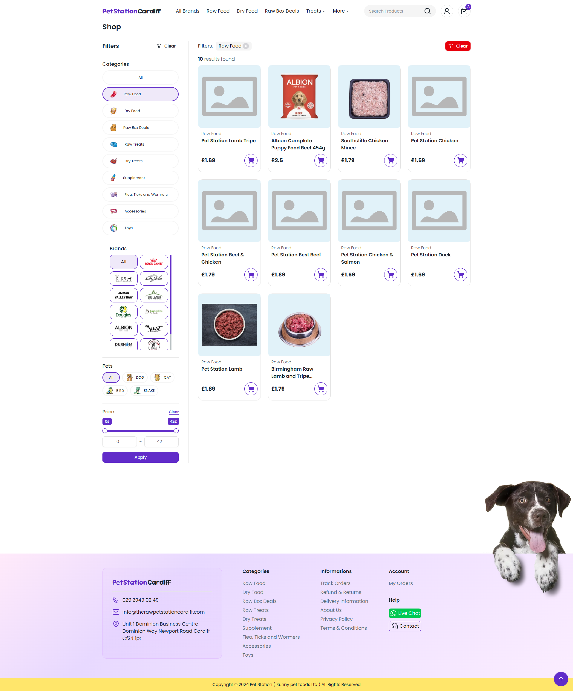

# 🐾 Pet Station - E-Commerce


## 📖 About The Project

**Pet Station** is a modern, responsive e-commerce frontend designed for a premium pet food store specializing in raw food, dry food, and treats. This project demonstrates a complete user journey from browsing categories to product selection and cart management.

Originally developed as a freelance project for a client in Cardiff, this repository now serves as a **portfolio showcase** demonstrating my skills in building complex, aesthetically pleasing, and user-friendly web interfaces using modern frontend technologies.

> **⚠️ Note:** This repository contains the **Frontend** code only. The backend (Strapi Headless CMS) is hosted separately and is currently inactive. Therefore, some dynamic data fetching features may not function in the live demo, but the UI/UX architecture is fully accessible for code review.

---

## 📸 Screenshots & UI Design

The design focuses on a clean, trustworthy, and playful aesthetic suitable for pet owners.

### 🏠 Home Page

Features a dynamic hero section, "Shop by Categories" navigation, featured products, and brand sliders.

<p align="center">
  
</p>

### 🛍️ Product Detail Page

Includes detailed product descriptions, nutritional information, stock status, and a related products carousel.

<p align="center">
  
</p>

### 🛍️ Product List and Filter Page

<p align="center">
  
</p>

---

## ✨ Key Features

- **Responsive Design:** Fully optimized layout for Mobile, Tablet, and Desktop screens.
- **Dynamic Product Filtering:** Users can filter products by brands (e.g., Albion, Southcliffe) and categories (Raw, Dry, Treats).
- **Interactive UI Components:**
    - Custom Sliders/Carousels for "Featured Products" and "Brands".
    - Smooth hover effects and transitions.
    - Quantity selectors and "Add to Cart" interactions.
- **Cart Management:** State management for handling cart items, quantities, and totals.
- **SEO Friendly:** Built with semantic HTML and Next.js optimization principles.

## 🛠️ Tech Stack

This project was built using the following technologies:

- **Frontend Framework:** [React.js](https://reactjs.org/) / [Next.js](https://nextjs.org/)
- **Styling & UI:** [Tailwind CSS](https://tailwindcss.com/) & **[Shadcn/ui](https://ui.shadcn.com/)**
- **State Management:** **[Zustand](https://github.com/pmndrs/zustand)**
- **Backend (CMS):** **[Strapi](https://strapi.io/)**
- **Validation:** **[Zod](https://zod.dev/)**
- **Payments:** **[Stripe](https://stripe.com/)**

## 🚀 Getting Started

To explore the codebase locally, follow these steps:

### Prerequisites

- Node.js (v14 or higher)
- npm or yarn

### Installation

1.  Clone the repository:

    ```bash
    git clone [https://github.com/zamazincode/petstationcardiff-client.git](https://github.com/zamazincode/petstationcardiff-client.git)
    ```

2.  Navigate to the project directory:

    ```bash
    cd petstationcardiff-client
    ```

3.  Install dependencies:

    ```bash
    npm install
    # or
    pnpm install
    ```

4.  **Configuration (Optional):**
    Since the backend is inactive, you can skip environment variable configuration. However, typically you would create a `.env.local` file:

    ```env
    NEXT_PUBLIC_STRAPI_URL=http://localhost:1337
    NEXT_PUBLIC_STRIPE_PUBLISHABLE_KEY=pk_test_
    NEXT_PUBLIC_SITE_URL=http://localhost:3000
    STRIPE_SECRET_KEY=sk_test_
    ```

5.  Run the development server:

    ```bash
    npm run dev
    # or
    pnpm dev
    ```

6.  Open [http://localhost:3000](http://localhost:3000) with your browser to see the result.

## 📂 Project Structure

```bash
petstationcardiff-client/
│
├── app/                # Next.js App Router pages & layouts
│   ├── (shop)/         # Shop-related routes (products, categories)
│   ├── product/        # Product detail pages
│   ├── cart/           # Cart page
│   └── layout.tsx      # Root layout
│
├── components/         # Reusable UI components
│   ├── ui/             # Atomic UI elements (buttons, inputs, etc.)
│   ├── layout/         # Header, Footer, Navigation
│   ├── product/        # Product cards, product sliders
│   └── cart/           # Cart related components
│
├── lib/                # Utility functions & helpers
│   ├── api.ts          # API configuration (Strapi integration)
│   ├── utils.ts        # Reusable helper functions
│   └── constants.ts    # Static configuration values
│
├── public/             # Static assets (images, icons, fonts)
├── styles/             # Global styles (if applicable)
├── middleware.ts       # Route protection / custom middleware
├── next.config.ts      # Next.js configuration
└── tsconfig.json       # TypeScript configuration
```

This structure was designed to ensure scalability and maintainability for real-world production use.

## 👨‍💻 Author

- Portfolio: [fatihkabul.vercel.app](https://fatihkabul.vercel.app)
- LinkedIn: [Fatih Kabul](https://www.linkedin.com/in/fatihkabul/)
- GitHub: [zamazincode](https://github.com/zamazincode)

## 📄 License

This project is licensed under the MIT License.
